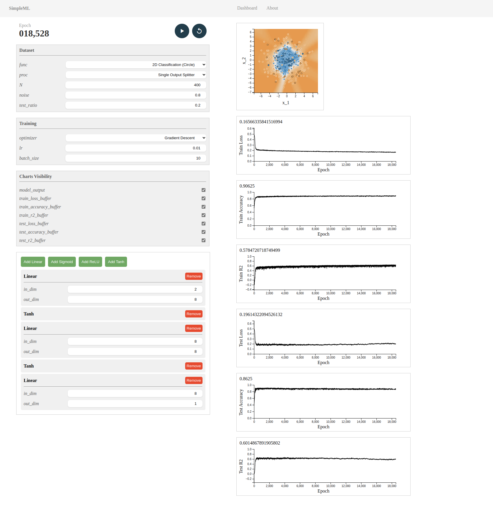
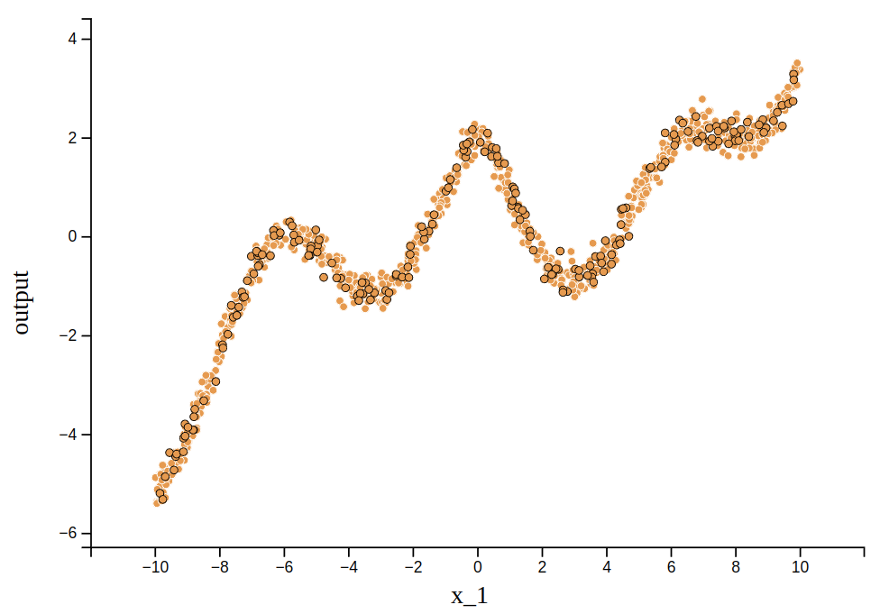
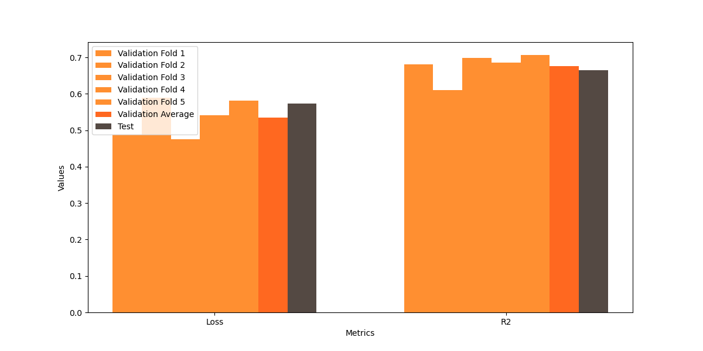
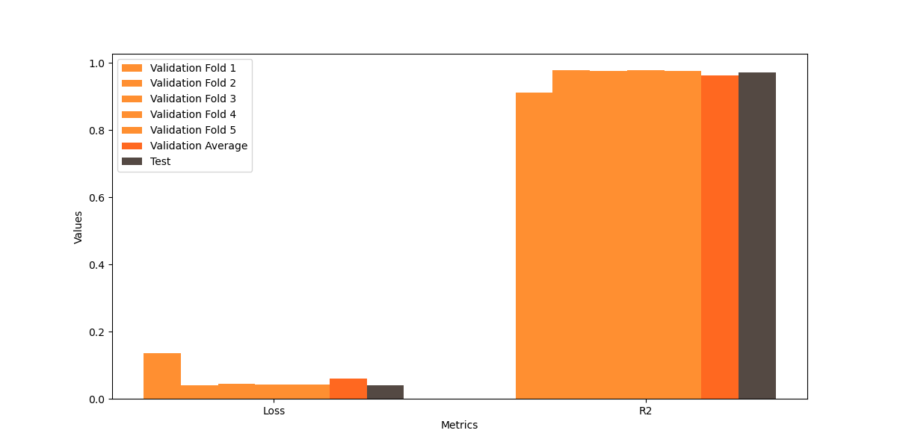
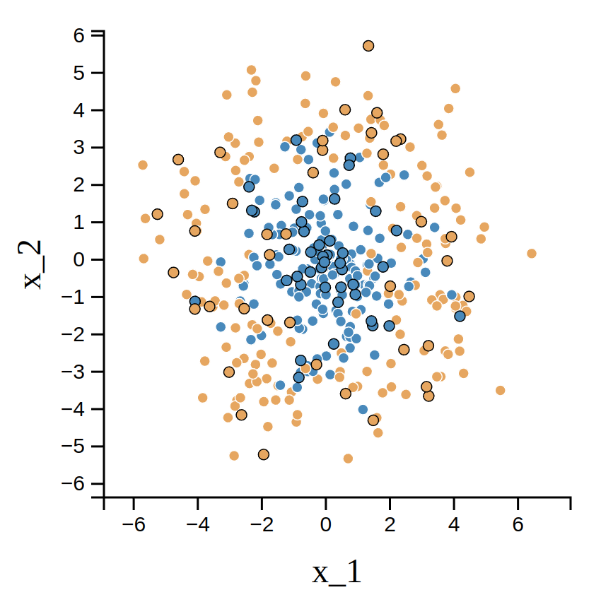
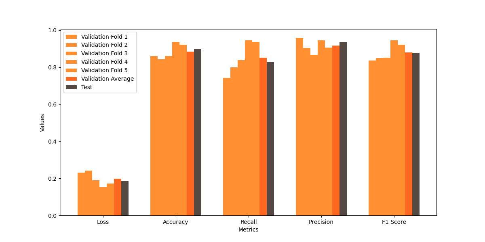
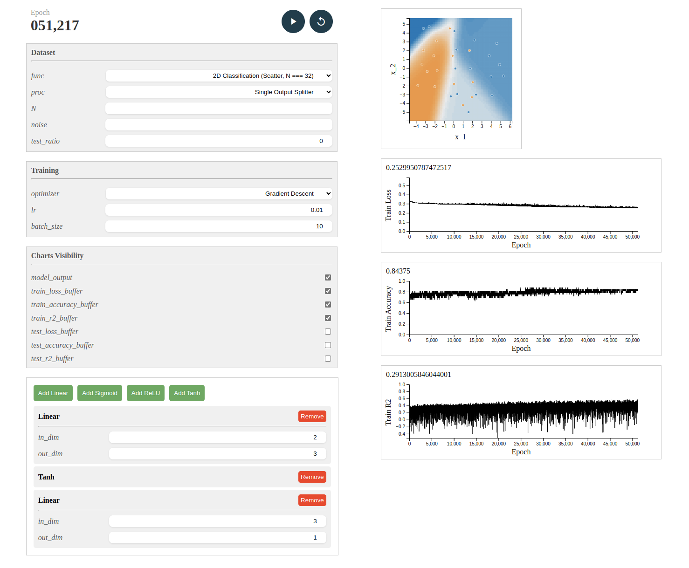
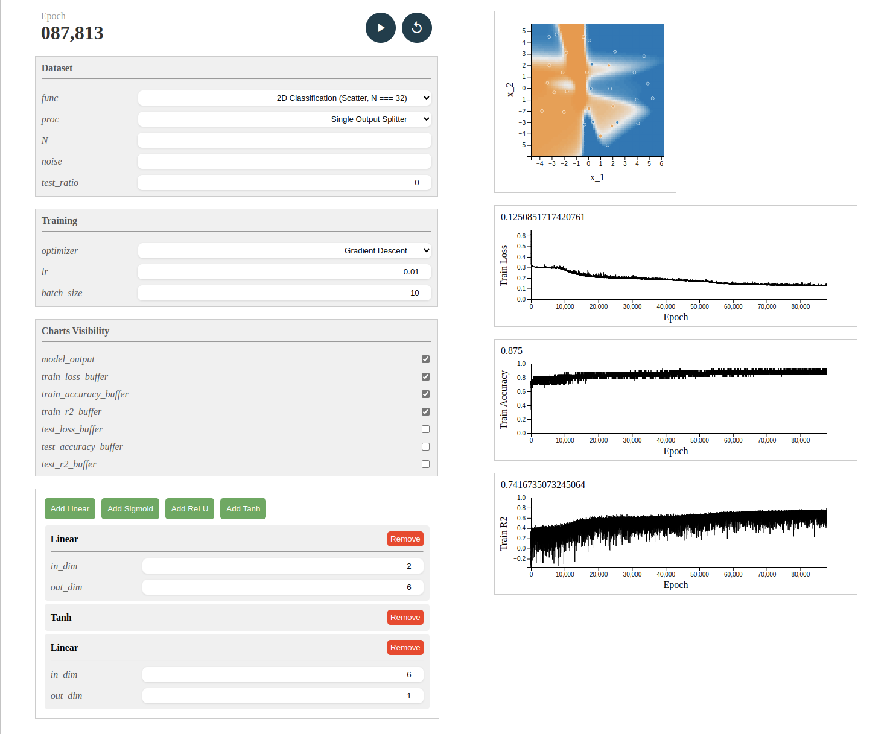
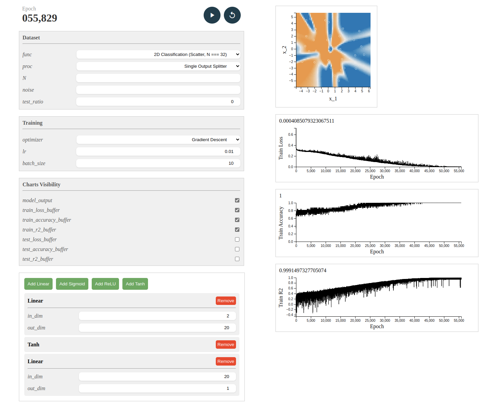

# SDM274 Assignment 05 - Multilayer Perceptron

### Requirements

1. Develop a Multilayer Perceptron (MLP) Model Using NumPy:

    Create a Python program that leverages NumPy to implement an MLP capable of handling any number of layers and units per layer.
    Ensure that the program includes both the forward and backward propagation processes.
    Implement Mini-batch and Stochastic Gradient Descent Updates:

    Write code to update the model parameters using both mini-batch and stochastic gradient descent methods.
    Ensure that these updates are integrated into the training process of the MLP model.

2. Cross-Validation Implementation:

    Develop code for k-fold cross-validation to assess the model's performance.
    This should allow for the evaluation of different hyperparameters and their impact on model accuracy.

3. Nonlinear Function Approximation:

    Select a complex nonlinear function with a single input and a single output.
    Generate a dataset by adding noise to the function's output.
    Utilize the MLP model with various hyperparameters (number of layers, number of units per layer) to approximate the nonlinear function.
    Use k-fold cross-validation to determine which set of hyperparameters provides the best approximation.
    Demonstrate the results and discuss the findings.

4. Classifier Performance Evaluation:

    Create a dataset similar to the one depicted on page 14 of the provided PPT of MLP lecture.
    Experiment with the MLP model using different hyperparameters (number of layers, number of units per layer) to classify the dataset.
    Validate the model's classification capabilities using k-fold cross-validation and identify the best performing configuration.
    Demonstrate the classification results and evaluate the model's performance using accuracy, recall, precision, and F1 score metrics.

5. Submission Requirements:

    Ensure that your code is well-documented and follows good programming practices.
    Include a detailed report explaining your methodology, the results of your experiments, and your conclusions.
    The report should also include visualizations of the dataset, the model's performance, and any other relevant findings.

### Implementation

#### Overview

This experiment implements a multilayer perceptron framework that is used in a similar way to PyTorch (without automatic derivation), allowing the user to customise the network structure, pick the activation function, optimiser, loss function, outcome metrics evaluation function, and provides tools for dataset generation and partitioning (for testing or k-fold cross-validation).

The above functionality is encapsulated in a Python package `simple_ml`, and a web UI based on the Sanic backend and Vue3 frontend is provided in the `dashboard` module within it. The backend core can be started using `python -m simple_ml.dashboard.server` in the root directory, and the frontend can be started using other tools such as NodeJS.

Due to the large number of code files and the need to maintain a hierarchical structure, please forgive me if I can only use .zip commits. I'll quote important code snippets directly in the text where necessary.

#### Custom Package: simple_ml

I have divided the whole machine learning process into dataset preparation, model building, loss function selection, and optimiser configuration, which are implemented in some sub-modules.

##### Dataset

Datasets are often read from spreadsheet files and stored using numpy arrays. I implement a `Dataset` class and implement `__len__` and `__getitem__` to allow the use of `len` to get the number of data entries and to get a segment of data by index, respectively. Later, for larger datasets, you can build on this to read from and write to the hard drive.

For datasets we generally need to do some preprocessing, e.g. for supervised learning we need to classify features and labels (inputs and outputs), as well as some data may need to be converted to a different format or complemented. Since the processing is different in different cases, it is straightforward for the user to provide a function object for processing, which is not done by default. For example, a `label_split_for_single_output_dataset` method is provided in `.data.samples` for datasets whose labels are only in the last column.

The implementation is as follows:

```python
class Dataset:
    def __init__(self, **kwargs):
        self.data_raw: np.ndarray = kwargs.get('data', None) # the whole table
        self.file_path: str = kwargs.get('file_path', None)
        assert (self.data_raw is not None and self.file_path is None) or (self.data_raw is None and self.file_path is not None) # only one of them should be provided

        self.preprocess_func = kwargs.get('preprocess_func', None)
        if self.preprocess_func is None:
            self.preprocess_func = self.default_preprocess_func

        if self.file_path is not None:
            # from disk
            file_type = kwargs.get('file_type', 'csv')
            if file_type == 'csv':
                # csv
                header = kwargs.get('header', None) # no header in default
                self.data_raw = pd.read_csv(self.file_path, header = header).to_numpy() # TODO: header
            else:
                pass # TODO: other file types
        
        self.datas: Union[np.ndarray, list[np.ndarray]] = self.preprocess_func(self.data_raw)
            # np.ndarray for the case of only one data source, list[np.ndarray] for the case of multiple data sources
    
    """ @Override """
    def default_preprocess_func(self, data: np.ndarray):
        pass # modify/fill data (the reference to self.data_raw)
        return data # return a list of spilt tables (each of them is a view sliced from self.data_raw, so self.data_raw is not needed to be deleted)
            # only one element, no list wrapping

    def __len__(self):
        return self.data_raw.shape[0]

    def __getitem__(self, index):
        if isinstance(self.datas, np.ndarray):
            return self.datas[index]
        elif isinstance(self.datas, list) or isinstance(self.datas, tuple):
            return [d[index] for d in self.datas]
```

Next up is the use of datasets. The optimiser may fetch the data in the form of a batch each time during iteration, so I implement a `DataIterator` class to achieve this, by implementing the `__iter__` and `__next__` methods to make its objects usable as iterators. The option to randomly disrupt as well as loop through the reads is also implemented, as may be required.

From this, we can call the dataset in a manner similar to `for batch, [features, labels] in enumerate(train_iter_kfold)`. This is implemented as follows:

```python
class DataIterator:
    def __init__(self, dataset, batch_size = 1, shuffle = False, cyclic = False):
        self.dataset: Dataset = dataset
        self.batch_size: int = min(batch_size, len(dataset)) if batch_size is not None else len(dataset)
        self.shuffle: bool = shuffle
        self.cyclic: bool = cyclic

        self.indices: list = list(range(len(dataset)))
        self.next_idx: int = batch_size

        if shuffle:
            random.shuffle(self.indices)
    
    def reset(self):
        self.next_idx = self.batch_size
        if self.shuffle:
            random.shuffle(self.indices)

    def __iter__(self):
        return self

    def __next__(self):
        exceed = self.next_idx - len(self.dataset)
        if exceed >= 0:
            if exceed >= self.batch_size: # did not cycle to the beginning and exceed (StopIteration)
                self.reset()
                raise StopIteration
            batch_indices = self.indices[(self.next_idx - self.batch_size):] # collect left samples
            if self.cyclic: # cyclic, complete the batch
                self.next_idx = exceed
                if self.shuffle:
                    random.shuffle(self.indices)
                batch_indices.extend(self.indices[:exceed])
        else:
            batch_indices = self.indices[(self.next_idx - self.batch_size):self.next_idx]
        
        self.next_idx += self.batch_size
        batch_data = self.dataset[batch_indices]
        return batch_data # return in np.ndarray
```

In addition to this there are a number of functions that may be used, such as `split_train_and_test_dataset` for dividing the training and test sets, `merge_datasets` for merging Dataset objects, `split_k_fold_cross_validation_dataset` for dividing the set of validations used for cross-validation, etc. validation_dataset`, etc.

There are also samples of commonly used datasets under the `.data` sub-module, such as datasets for binary classification problems with specific distributions, datasets obtained visually from Lecture Slides P14, etc.

##### Model

The model is implemented in layers. Multiple-input multiple-output linear operations, activation functions, etc. are separate layers, and currently only `Linear`, `Sigmoid`, `ReLU`, and `Tanh` (and also `Softmax`) have been implemented based on demand. The implementations of these layers all inherit from the `Model` class and implement the `forward` and `backward` methods.

The nodes within the layers are stored via objects of the `Variable` class, which internally include the operation value `value` and the gradient information `gradient`, internally using numpy arrays with overloaded operators for ease of use, to which records of the computed graphs can later be added for automatic derivation.

The forward propagation process of `Model` performs the computation of the values and also adds the input variables to the `input` property and returns new variables for `output` for use in the next layer, while the back propagation is written by the user to multiply the gradient of the output variables by the gradient within the layer and pass it to the input variables. The framework of `Model` is as follows:

```python
class Model:
    """ @Override (super().__init__() should be called) """
    def __init__(self):
        """ Model initialization """
        self.input = None
        self.output = None
        self.params = []
        pass # model hyperparameters
        pass # parameters -> self.params
    
    """ @Override (super().forward(X) should be called) """
    def forward(self, X: Variable) -> Variable:
        """ Forward propagation and model structure recording """
        assert isinstance(X, Variable)
        self.input = X # TODO: is it necessary to set self.input only when the model is called for the first time? Hint: currently the input of the input layer should be updated every time.
        pass # forward propagation and results -> self.output
        pass # return self.output
    
    """ @Override """
    def backward(self):
        """ Manually gradient calculation (forward propagation should be conducted before backward propagation) """
        pass # update .gradient of each Variable in self.input and self.params

    def parameters(self):
        """ A view of model parameters """
        return self.params

    def __call__(self, *args: Variable) -> Variable:
        return self.forward(*args)
```

As an example, the constructor of the linear layer `Linear` initialises the hyperparameters, parameter variables:

```python
class Linear(Model):
    def __init__(self, in_dim: int, out_dim: int):
        super(Linear, self).__init__()
        self.n = in_dim
        self.m = out_dim
        """
            * W: weights, n (in_dim) neurons -> m (out_dim) neurons
                W = [
                    [w_00, w_01, ..., w_0m],
                    [w_10, w_11, ..., w_1m],
                    ...,
                    [w_n0, w_n1, ..., w_nm]
                ]

            * b: biases, add by broadcasting
                b = [b_0, b_1, ..., b_m]

            * X: input data, N samples (batch size)
                X = [
                    [x_0^(0), x_1^(0), ..., x_n^(0)],
                    [x_0^(1), x_1^(1), ..., x_n^(1)],
                    ...,
                    [x_0^(N - 1), x_1^(N - 1), ..., x_n^(N - 1)]
                ]
        """
        self.W = Variable(np.random.uniform(-0.5, 0.5, (self.n, self.m)), derivable = True)
        self.b = Variable(np.ones(self.m) * 0.1, derivable = True)
        self.params = [self.W, self.b]
```

Its forward propagation process can be implemented using simple matrix multiplication and addition (see note above for specific matrix style provisions), noting that the results are stored to `self.output` and returned:

```python
    def forward(self, X):
        super(Linear, self).forward(X)
        """
            Y = X @ W + b
        """
        self.output = X @ self.W + self.b
        return self.output
```

The backward propagation process is implemented by multiplying the gradient of the output variables by the gradient within the layer and passing it to the input variables (see notes in the code):

```python
    def backward(self):
        """
            * For multiple samples in X, take the average of gradients.
            * X = self.input.value
            * dE/dY = Y.gradient
            * dE/dW = dE/dY * dY/dW = X.value.T @ Y.gradient / N
                dE/dW[i, j] = 1/N * Sum_{k=0}^{N-1} {X[k, i] * dE/dY[k, j]}
                1/N is multiplied to take the average over N samples.
            * dE/db = dE/dY * dY/db = dE/dY * 1 = mean(Y.gradient, axis = 0)
                mean() is used to take the average over N samples.
            * dE/dX = Sum_{j=0}^{m-1} {dE/dY_j * dY_j/dX} = mean(Y.gradient @ W.value.T, axis = 0)
                Each line of dE/dY @ W.T is the gradient of the corresponding sample in X:
                    [Sum_{j=0}^{m-1} {dE/dY_j * W_0j}, Sum_{j=0}^{m-1} {dE/dY_j * W_1j}, ..., Sum_{j=0}^{m-1} {dE/dY_j * W_nj}]
                mean() is used to take the average over N samples.
        """
        X, Y = self.input, self.output
        N = X.value.shape[0]
        self.W.gradient = X.value.T @ Y.gradient / N
        self.b.gradient = np.mean(Y.gradient, axis = 0)
        X.gradient = np.mean(Y.gradient @ self.W.value.T, axis = 0)
```

The activation function is essentially the same, e.g. the implementation of the Sigmoid activation function:

```python
class Sigmoid(Model):
    def __init__(self, x_left_bound = -100, x_right_bound = 100):
        super(Sigmoid, self).__init__()
        self.x_left_bound = x_left_bound
        self.x_right_bound = x_right_bound
    
    def forward(self, X):
        super(Sigmoid, self).forward(X)
        """
            Y = 1 / (1 + exp(-X))
        """
        self.output = Variable(1 / (1 + np.exp(np.clip(-X.value, self.x_left_bound, self.x_right_bound))), derivable = True)
        return self.output
    
    def backward(self):
        """
            dE/dX = dE/dY * dY/dX = dE/dY * Y * (1 - Y)
        """
        self.input.gradient = self.output.gradient * self.output.value * (1 - self.output.value)
```

There is also a focus on building a complete network model with the layers. As mentioned earlier, the user can manually build up the inter-layer connections by `forward` and `backward` them in turn to achieve back propagation. This process is encapsulated in the `Sequential` class, which returns a model object representing the whole by passing in a list containing information about each layer:

```python
class Sequential(Model):
    def __init__(self, layers_list):
        super(Sequential, self).__init__()
        self.layers = layers_list
        for layer in self.layers:
            self.params.extend(layer.parameters())
    
    def forward(self, X):
        super(Sequential, self).forward(X)
        self.output = X
        for layer in self.layers:
            self.output = layer(self.output)
        return self.output
    
    def backward(self):
        for layer in self.layers[::-1]:
            layer.backward()
```

For example, the usage of the `Sequential` class is as follows:

```python
model = Sequential([
    Linear(2, 30),
    Tanh(),
    Linear(30, 30),
    Tanh(),
    Linear(30, 1)
])
```

##### Loss

The loss function is the objective of the training process, its value is needed to visualise the loss curve and its gradient is used for the optimiser to iterate. I implemented `MSELoss` and `CrossEntropyLoss` in `.training.loss`. They are actually similar to `Model` and need to implement `forward` and `backward` methods. Take `MSELoss` as an example:

```python
class MSELoss(Loss):
    def forward(self, X, T):
        return np.mean((X.value - T) ** 2) / 2
    
    def backward(self, X, T):
        X.gradient = (X.value - T)
```

The `Loss` class implements the `__call__` method, which directly calls the object as a function, passing in the predicted and true values, which will return the loss value and store the calculated gradient into the corresponding `Variable` object without having to manually call the `backward` method.

##### Optimizer

The optimiser is used to update the model parameters, decoupled from the model, which needs to be passed in when instantiated (the model's parameter variables are all already in `self.params`, just pass in their references).

The conventional optimiser, i.e. gradient descent, is implemented as `GD`. As for `MBGD` and `SGD`, the optimiser is the same, only the `batch_size` used to call the data at iteration time is different, i.e. it has been merged into the training process. The optimiser mainly needs to implement the `step` method, i.e. the process of updating the parameters. For example gradient descent is implemented as follows:

```python
class GD(Optimizer):
    """
        Gradient Descent Optimizer
        P.S. batch is decided by the data provider - in any case, the Variable().value's 0-th dimension is the batch size.
    """
    def __init__(self, params, lr = 0.01):
        super(GD, self).__init__(params)
        self.lr = lr

    def step(self):
        for param in self.params:
            param.value -= self.lr * param.gradient
```

In addition I have implemented `MomentumGD`, a gradient descent method with inertia, as well as the commonly used `Adam` optimiser with adaptive learning rates (including L1 and L2 regularisation), which will not be repeated here, e.g. the latter:
    
```python
class Adam(Optimizer):
    """
        Adam Optimizer (TODO: Regularization to be checked)
    """
    def __init__(self, params, lr = 0.001, beta1 = 0.9, beta2 = 0.999, epsilon = 1e-8, regularization = None, regularization_lambda = 0.0):
        super(Adam, self).__init__(params)
        self.lr = lr
        self.beta1 = beta1
        self.beta2 = beta2
        self.epsilon = epsilon
        self.t = 0
        self.m = [np.zeros_like(param.value) for param in self.params]
        self.v = [np.zeros_like(param.value) for param in self.params]
        self.regularization = regularization
        self.regularization_lambda = regularization_lambda

    def step(self):
        self.t += 1
        for i, param in enumerate(self.params):
            self.m[i] = self.beta1 * self.m[i] + (1 - self.beta1) * param.gradient
            self.v[i] = self.beta2 * self.v[i] + (1 - self.beta2) * param.gradient ** 2
            m_hat = self.m[i] / (1 - self.beta1 ** self.t)
            v_hat = self.v[i] / (1 - self.beta2 ** self.t)

            # regularization term
            if self.regularization == "L1":
                regularization_term = self.regularization_lambda * np.sign(param.value)
            elif self.regularization == "L2":
                regularization_term = self.regularization_lambda * param.value
            else:
                regularization_term = 0

            param.value -= self.lr * (m_hat / (np.sqrt(v_hat) + self.epsilon) + regularization_term)
```

In the experimental tests, `Adam` does converge much faster than `GD`, but when the number of training rounds is higher, the loss will be reversed, and `GD` is mainly used in the subsequent experiments.

##### Visualization (matplotlib)

The loss curves, model outputs during training can be visualised using matplotlib. I encapsulated this part of the function in `.visualisation.plot`, and will not repeat the details. The visualisation of dynamics using matplotlib is slow, so I subsequently implemented a Web UI to port this part of the functionality to the front-end.

##### Usage

Here's a simple example of how to use it (similar to PyTorch):

```python
dataset = Dataset(data = data_np, preprocess_func = label_split_for_single_output_dataset)
train_dataset, test_dataset = split_train_and_test_dataset(dataset, 0)

model = Sequential([
    Linear(2, 4),
    Sigmoid(),
    Linear(4, 2),
    Sigmoid(),
    Linear(2, 1)
])

loss_func = MSELoss()

optimizer = GD(model.params, lr = 0.01)

train_iter = DataIterator(train_dataset, batch_size = 10, shuffle = True, cyclic = False)

epoch_num = 10000
train_loss_history = []
train_accuracy_history = []

for epoch in range(epoch_num):
    train_loss = 0
    train_accuracy = 0

    for batch, [features, labels] in enumerate(train_iter):
        prediction = model(Variable(features, derivable = True)) # must be wrapped by Variable
        loss = loss_func(prediction, labels) # calculate loss and gradient (!)

        model.backward()
        optimizer.step()

        train_loss += loss * features.shape[0]
        train_accuracy += eval_binary_accuracy(prediction, labels) * features.shape[0]
    
    # record training loss and accuracy
    train_loss /= len(train_dataset)
    train_accuracy /= len(train_dataset)

    train_loss_history.append(train_loss)
    train_accuracy_history.append(train_accuracy)
```

##### Performance Evaluating: Cross-validation

Evaluation of model performance requires cross-validation, which can prevent overfitting by dividing the training set and taking one of them at a time as the validation set to evaluate the model performance. The results of the evaluation can be used as a relatively objective reference based on which hyperparameter searches can be performed.

I have provided methods for dividing as well as traversing the cross-validation dataset, which are used as follows:

```python
K = 5
datasets = split_k_fold_cross_validation_dataset(train_dataset, k = K)
...
for i in range(K):
    train_ds = merge_datasets([datasets[j] for j in range(K) if j != i])
    valid_ds = datasets[i]
    ...
```

There are also visualisation tools for displaying the evaluation results for each fold, as well as the final averaged results, details of which can be found in the demo program at the beginning of `main_cross_validation_`.

#### Web User Interface: simple_ml.dashboard

To prevent the visualisation process from affecting the speed of model training, I ported it to the front-end, using Vue3 and D3.js. A back-end core is also provided to work with the front-end, allowing the user to configure the model structure, select parameters and train them, and view the visualisation results, etc., all through a graphical interface.

##### Frontend (Vue3 & D3.js)

Below is a screenshot of the front-end page:



The interface is divided into two main parts, left and right, the left side of the console, the right side of the visualisation charts, time is limited, the layout did not continue to improve. On the left side, you can view the epoch, control the start, pause and reset of the training, select the dataset, configure the hyperparameters and so on. The Model Builder on the bottom left allows users to add Layers on their own, adjust the order and build the model structure by dragging and dropping with the mouse. The right side shows a series of charts, including the output of the model and the change curves of some indicators, and you can choose which charts to display through the checkbox on the left side.

##### Backend Core (Sanic)

The core code of the back-end is in `.dashboard.core`, which is responsible for controlling the start and stop of the training task, communicating with the front-end via WebSocket, accepting requests from the front-end and returning the required data. The specific implementation will not be repeated, it is not the core of this experiment.

### Experiments

#### Fitting a Complex Nonlinear SISO Function

For this experiment I chose a single-input, single-output complex nonlinear function, generated a dataset with noise, fitted it using an MLP model, and determined the best combination of hyperparameters through cross-validation.

The function I chose was `np.cos(x) + np.exp(-x ** 2) + x ** 3 / 233`, with the domain of definition taken to be `[-10, 10]`, and Gaussian noise with a standard deviation of 0.2 was added in order to get the dataset, which roughly looks like this (black bordered dots are the test set, white bordered dots are the training set):



Splitting the dataset and then training and evaluating it separately, the code is as follows (modifying the parameters to obtain different results):

```python
import numpy as np

import matplotlib.pyplot as plt

from simple_ml import Variable, Dataset, DataIterator, merge_datasets, split_train_and_test_dataset, split_k_fold_cross_validation_dataset
from simple_ml.data.samples import label_split_for_single_output_dataset, generate_2d_classification_circle, generate_2d_classification_exclusive_or, generate_1d_regression_with_function
from simple_ml.evaluation.criterion import eval_binary_accuracy, eval_binary_recall, eval_binary_precision, eval_binary_f1_score, eval_regression_r2
from simple_ml.model import Model, Sequential
from simple_ml.model.layers import Linear, ReLU, Sigmoid, Tanh
from simple_ml.training.loss import MSELoss, CrossEntropyLoss
from simple_ml.training.optimizer import GD, Adam
from simple_ml.visualization.plot import TwoFeaturesClassificationModelVisualizer


""" Dataset """
data_np = generate_1d_regression_with_function(N = 1000, f = lambda x: np.cos(x) + np.exp(-x ** 2) + x ** 3 / 233, x_range = (-10, 10), noise = 0.2)

dataset = Dataset(data = data_np, preprocess_func = label_split_for_single_output_dataset)
train_dataset, test_dataset = split_train_and_test_dataset(dataset, 0.2)


""" Model """
model = Sequential([
    Linear(1, 20),
    Sigmoid(),
    Linear(20, 20),
    Sigmoid(),
    Linear(20, 1)
])

loss_func = MSELoss()

optimizer = GD(model.params, lr = 0.01)


""" Cross-Validation & Training """
K = 5
datasets = split_k_fold_cross_validation_dataset(train_dataset, k = K)

losses = []
r2s = []

epoch_num = 4000

for i in range(K + 1):
    if i < K:
        print(f"[Info] Training on cross-validation fold {i + 1} / {K}")
    else:
        print(f"[Info] Training on whole training set")

    # prepare train and validation set
    if i < K:
        train_ds = merge_datasets([datasets[j] for j in range(K) if j != i])
        valid_ds = datasets[i]
    else:
        train_ds = train_dataset
        valid_ds = test_dataset
    train_iter_kfold = DataIterator(train_ds, batch_size = 10, shuffle = True, cyclic = False)

    # train
    for epoch in range(epoch_num):
        for batch, [features, labels] in enumerate(train_iter_kfold):
            prediction = model(Variable(features, derivable = True)) # must be wrapped by Variable
            loss = loss_func(prediction, labels) # calculate loss and gradient (!)

            model.backward()
            optimizer.step()

    # evaluate on validation/testing set
    prediction = model(Variable(valid_ds.datas[0], derivable = True))

    loss = loss_func(prediction, valid_ds.datas[1])
    r2 = eval_regression_r2(prediction, valid_ds.datas[1])

    if i < K:
        print(f"[Info] Performance for fold {i + 1} / {K}: Loss = {loss}, R2 = {r2}")
    else:
        print(f"[Info] Performance on test set: Loss = {loss}, R2 = {r2}")

    losses.append(loss)
    r2s.append(r2)
    

categories = ["Loss", "R2"]
validation_results = [losses[:-1], r2s[:-1]]
test_results = [losses[-1], r2s[-1]]

averages = [np.mean(val) for val in validation_results]
print(f"[Info] Average performance on validation folds: Loss = {averages[0]}, R2 = {averages[1]}")

bar_colors = ['#FF8F31', '#FF8F31', '#FF8F31', '#FF8F31', '#FF8F31', '#FF6820', '#544943']
bar_colors = ['#FF8F31', '#FF8F31', '#FF8F31', '#FF8F31', '#FF8F31', '#FF6820', '#544943']
bar_width = 0.1
bar_positions = np.arange(len(categories))

plt.figure(figsize = (12, 6))
for i in range(K):
    plt.bar(bar_positions + i * bar_width, [val[i] for val in validation_results], width = bar_width, label = f'Validation Fold {i + 1}', color = bar_colors[i])
plt.bar(bar_positions + K * bar_width, averages, width = bar_width, label = 'Validation Average', color = bar_colors[K])
plt.bar(bar_positions + (K + 1) * bar_width, test_results, width = bar_width, label = 'Test', color = bar_colors[K + 1])

plt.xlabel('Metrics')
plt.ylabel('Values')
plt.xticks(bar_positions + (K + 1) * bar_width / 2, categories)
plt.legend()
plt.show()
```

Due to time constraints, a detailed hyperparameter search was not performed, but rather some of the characterised model structures were selected for testing, expressed in terms of the number of neurons and type of activation function in each layer (including the input layer), as `1,10,1,sig`, `1,20,1,sig`, `1,30,1,sig`, `1,5,5,1,sig`, `1,10, 10,1,sig`, `1,5,5,5,1,sig`, `1,10,10,10,1,sig`. For this one-dimensional regression problem we use R2 as an evaluation criterion. Where the results for `1,5,5,5,1,sig` are visualised as follows:



As well as `1,20,1,sig`'s:



Other charts (and records of specific values) are not listed, see `doc/cv/`. The average performance on the validation set for each case is tabulated below:

| Model Structure | Loss | R2 |
| --- | --- | --- |
| 1,10,1,sig | 0.3478 | 0.7801 |
| 1,20,1,sig | 0.0609 | 0.9638 |
| 1,30,1,sig | 0.0738 | 0.9600 |
| 1,5,5,1,sig | 0.1914 | 0.8857 |
| 1,10,10,1,sig | 0.1355 | 0.9229 |
| 1,5,5,5,1,sig | 0.5346 | 0.6768 |
| 1,10,10,10,1,sig | 0.1996 | 0.8799 |

Looking at the values, the best performance is `1,20,1,sig`, i.e. a hidden layer using a layer of 20 neurons. For the same hidden layer, the performance of `1,10,1,sig` with fewer neurons and `1,30,1,sig` with more neurons declined, with the former possibly underfitting and the latter possibly overfitting. The overall performance of the multi-hidden layer structure is not as good as that of the single hidden layer, while `1,10,10,1,sig` outperforms `1,5,5,1,sig` for the same number of layers. The special case of `1,10,10,10,10,1,sig` performance is due to the two hidden layers, which may be affected by some other factors, such as slower training leading to earlier stopping, random validation process leading to the results of, etc. In conclusion, this experiment is rather rough and can only give general conclusions, the specific hyperparameter search requires more time and computational resources.

#### Two-feature Binary Classification

The experimental task was the same as above, except that the dataset was replaced with a binary classification problem with two-dimensional features. I chose a dataset similar to the distribution of concentric circles, with one class of points inside the inner circle and the other class of points on an outer circle, and generated the dataset by adding Gaussian noise so that the two classes of points overlap to some extent. The general look of the dataset is as follows:



Similarly, the dataset is split and then trained and evaluated separately with the following code:

```python
import numpy as np

import matplotlib.pyplot as plt

from simple_ml import Variable, Dataset, DataIterator, merge_datasets, split_train_and_test_dataset, split_k_fold_cross_validation_dataset
from simple_ml.data.samples import label_split_for_single_output_dataset, generate_2d_classification_circle, generate_2d_classification_exclusive_or, generate_1d_regression_with_function
from simple_ml.evaluation.criterion import eval_binary_accuracy, eval_binary_recall, eval_binary_precision, eval_binary_f1_score, eval_regression_r2
from simple_ml.model import Model, Sequential
from simple_ml.model.layers import Linear, ReLU, Sigmoid, Tanh
from simple_ml.training.loss import MSELoss, CrossEntropyLoss
from simple_ml.training.optimizer import GD, Adam
from simple_ml.visualization.plot import TwoFeaturesClassificationModelVisualizer


""" Dataset """
data_np = generate_2d_classification_circle(N = 400, r_0 = 3, r_1 = 3, noise = 0.8)

dataset = Dataset(data = data_np, preprocess_func = label_split_for_single_output_dataset)
train_dataset, test_dataset = split_train_and_test_dataset(dataset, 0.2)


""" Model """
model = Sequential([
    Linear(2, 30),
    Tanh(),
    Linear(30, 30),
    Tanh(),
    Linear(30, 1)
])

loss_func = MSELoss()

optimizer = GD(model.params, lr = 0.01)


""" Cross-Validation & Training """
K = 5
datasets = split_k_fold_cross_validation_dataset(train_dataset, k = K)

losses = []
accuracies = []
recalls = []
precisions = []
f1_scores = []

epoch_num = 12000

for i in range(K + 1):
    if i < K:
        print(f"[Info] Training on cross-validation fold {i + 1} / {K}")
    else:
        print(f"[Info] Training on whole training set")

    # prepare train and validation set
    if i < K:
        train_ds = merge_datasets([datasets[j] for j in range(K) if j != i])
        valid_ds = datasets[i]
    else:
        train_ds = train_dataset
        valid_ds = test_dataset
    train_iter_kfold = DataIterator(train_ds, batch_size = 10, shuffle = True, cyclic = False)

    # train
    for epoch in range(epoch_num):
        for batch, [features, labels] in enumerate(train_iter_kfold):
            prediction = model(Variable(features, derivable = True)) # must be wrapped by Variable
            loss = loss_func(prediction, labels) # calculate loss and gradient (!)

            model.backward()
            optimizer.step()

    # evaluate on validation/testing set
    prediction = model(Variable(valid_ds.datas[0], derivable = True))

    loss = loss_func(prediction, valid_ds.datas[1])
    accuracy = eval_binary_accuracy(prediction, valid_ds.datas[1])
    recall = eval_binary_recall(prediction, valid_ds.datas[1])
    precision = eval_binary_precision(prediction, valid_ds.datas[1])
    f1_score = eval_binary_f1_score(prediction, valid_ds.datas[1])

    if i < K:
        print(f"[Info] Performance for fold {i + 1} / {K}: Loss = {loss}, Accuracy = {accuracy}, Recall = {recall}, Precision = {precision}, F1 Score = {f1_score}")
    else:
        print(f"[Info] Performance on test set: Loss = {loss}, Accuracy = {accuracy}, Recall = {recall}, Precision = {precision}, F1 Score = {f1_score}")
    
    losses.append(loss)
    accuracies.append(accuracy)
    recalls.append(recall)
    precisions.append(precision)
    f1_scores.append(f1_score)
    

categories = ["Loss", "Accuracy", "Recall", "Precision", "F1 Score"]
validation_results = [losses[:-1], accuracies[:-1], recalls[:-1], precisions[:-1], f1_scores[:-1]]
test_results = [losses[-1], accuracies[-1], recalls[-1], precisions[-1], f1_scores[-1]]

averages = [np.mean(val) for val in validation_results]
print(f"[Info] Average performance on validation folds: Loss = {averages[0]}, Accuracy = {averages[1]}, Recall = {averages[2]}, Precision = {averages[3]}, F1 Score = {averages[4]}")

bar_colors = ['#FF8F31', '#FF8F31', '#FF8F31', '#FF8F31', '#FF8F31', '#FF6820', '#544943']
bar_colors = ['#FF8F31', '#FF8F31', '#FF8F31', '#FF8F31', '#FF8F31', '#FF6820', '#544943']
bar_width = 0.1
bar_positions = np.arange(len(categories))

plt.figure(figsize = (12, 6))
for i in range(K):
    plt.bar(bar_positions + i * bar_width, [val[i] for val in validation_results], width = bar_width, label = f'Validation Fold {i + 1}', color = bar_colors[i])
plt.bar(bar_positions + K * bar_width, averages, width = bar_width, label = 'Validation Average', color = bar_colors[K])
plt.bar(bar_positions + (K + 1) * bar_width, test_results, width = bar_width, label = 'Test', color = bar_colors[K + 1])

plt.xlabel('Metrics')
plt.ylabel('Values')
plt.xticks(bar_positions + (K + 1) * bar_width / 2, categories)
plt.legend()
plt.show()
```

Similarly, I tested `2,5,1,sig`, `2,10,1,sig`, `2,20,1,sig`, `2,5,5,1,tanh`, `2,10,10,1,tanh` and `2,30,30,1,tanh`. For the classification problem we use the metrics Accuracy, Recall, Precision and F1 Score and in the following comparisons we mainly use the comprehensive F1 Score for judgement. For example the result for `2,10,1,sig` is visualised as:



Again, the others are listed using the table:

| Model Structure | Loss | F1 Score |
| --- | --- | --- |
| 2,5,1,sig | 0.2345 | 0.8328 |
| 2,10,1,sig | 0.1977 | 0.8808 |
| 2,20,1,sig | 0.1932 | 0.8684 |
| 2,5,5,1,tanh | 0.2315 | 0.8246 |
| 2,10,10,1,tanh | 0.2458 | 0.8043 |
| 2,30,30,1,tanh | 0.2930 | 0.7899 |

From the above table it can be observed that `2,10,1,sig` performs best. The overall performance of the single hidden layer is better than the double hidden layer (the experiment replaced the activation function, which may have some effect, not too rigorous). For the same one hidden layer, too many or too few neurons resulted in lower average performance. For the same two hidden layers, 5 neurons per layer is sufficient, any more and the performance drops, suggesting that the problem is simpler and does not require a more complex network.

#### Supplement: Demonstration of the Effect of Hidden Layers on Fitting Ability (Slides P14)

Regarding the dataset in Lecture Slides Page 14, firstly a similar dataset needs to be generated according to the topic requirements, then fitted using different hidden layer structures, and finally the performance of the model is evaluated by cross-validation. However, it seems that cross-validation does not make sense for this kind of dataset, the data distribution is irregular and there are few data points, the result of the validation depends largely on the random division of the validation set. Therefore, this requirement is reflected in the first two experiments, where the datasets used may be different from those in the courseware.

Here, as a complementary experiment, we compare the fitting ability of different hidden layer structures using a dataset that is essentially the same as the one in the courseware (obtained by visual inspection). The models all use a two-layer model, the activation function uses a Sigmoid, and the optimiser uses a GD. no cross-validation is required, so I used the previously mentioned Web UI for the experiments.

Firstly, the case of 3 hidden neurons:



Then the case of 6 hidden neurons:



And finally the case of 20 hidden neurons:



As you can see, the more hidden neurons, the better the model fits, but it also means the model is more complex and prone to overfitting.

### Conclusion

Overall, the hyperparameters of the MLP are mainly network structure parameters, i.e., the number of layers of the model and the number of neurons per layer. The fitting ability is stronger for low number of layers, multiple hidden neuron counts, and multiple layer count networks. Cross-validation can check the overfitting of the model, which is easy to overfit when the model is too complex and has too many training rounds, resulting in poor performance of the average results of cross-validation.

The optimal network structure parameters can be found by means of hyperparameter search, but this process is costly. In practice, the network structure parameters can be chosen empirically and then the performance of the model can be verified through cross-validation.
