# SDM274 Midterm Project

## Tasks

1. **Data Preprocessing:**
   - Load the dataset and perform basic data cleaning to handle missing values and irrelevant features.
   - Normalize or standardize the features if necessary.

2. **Feature Engineering:**
   - Select or engineer features that could be relevant for predicting machine failures.

3. **Model Implementation:**
   - Implement linear regression, perceptron, and logistic regression models to predict machine failures.
   - Implement an MLP model to predict machine failures, using at least one hidden layer.

4. **Model Training and Evaluation:**
   - Split the dataset into training and testing sets (e.g., 70% training, 30% testing).
   - Train each model on the training set and evaluate their performance on the testing set.
   - Use appropriate metrics such as accuracy, precision, recall, F1-score, to evaluate the models.

5. **Model Comparison:**
   - Compare the performance of the different models.
   - Discuss the strengths and weaknesses of each model in the context of predictive maintenance.

6. **Hyperparameter Tuning:**
   - Perform hyperparameter tuning for the perceptron, logistic regression, and MLP models to improve their performance.

7. **Documentation:**
   - Write a detailed report documenting the entire process, including data preprocessing, model implementation, results, and conclusions.
   - Include visualizations and charts to support the findings.

8. **Presentation:**
   - Prepare a presentation to showcase the project findings to the class.

## Methodology

### Data Preprocessing

Load `ai4i2020.csv`, which has a total of 10000 pieces of data with 14 features each. The first two of these features are index and product ID, which are not helpful for prediction and are therefore deleted. `Machine failure` is the target variable which takes the value of 0 or 1 for no failure and failure respectively. The next five features are failure types, which are not considered in this project.

The remaining six features are `Type`, `Air temperature [K]`, `Process temperature [K]`, `Rotational speed [rpm]`, `Torque [Nm]`, `Tool wear [min]`.

Load first, discard useless information, and view basic information about the data. Use `.info()` to check the information of the features:

```
RangeIndex: 10000 entries, 0 to 9999
Data columns (total 7 columns):
 #   Column                   Non-Null Count  Dtype  
---  ------                   --------------  -----  
 0   Type                     10000 non-null  object 
 1   Air temperature [K]      10000 non-null  float64
 2   Process temperature [K]  10000 non-null  float64
 3   Rotational speed [rpm]   10000 non-null  int64  
 4   Torque [Nm]              10000 non-null  float64
 5   Tool wear [min]          10000 non-null  int64  
 6   Machine failure          10000 non-null  int64  
dtypes: float64(3), int64(3), object(1)
memory usage: 547.0+ KB
```

where `Type` is a three-valued discrete feature encoded as a numeric value. We can encode into a numerical value using:

```python
encoder_map = {value: idx for idx, value in enumerate(data_csv['Type'].unique())}
data_csv['Type'] = np.array([encoder_map[value] for value in data_csv['Type']])
```

By checking the data, we can see that there are no missing values in the dataset. Later, we will do some operations on the features and normalize the data.s

### Feature Engineering

The code for feature engineering is as follows:

```python
import seaborn as sns
import matplotlib.pyplot as plt

""" 1. Drop Type """
# data_csv = data_csv[data_csv['Type'] != 'H']
# data_csv.drop(columns = ['Type'], inplace = True)

""" 2. PCA """
# from sklearn.decomposition import PCA
# from sklearn.preprocessing import StandardScaler
# selected_col = [
#     'Air temperature [K]', 'Process temperature [K]',
#     'Rotational speed [rpm]', 'Torque [Nm]'
# ]
# data_to_pca = data_csv[selected_col]
# scaler = StandardScaler()
# scaled_data = scaler.fit_transform(data_to_pca)
# pca = PCA(n_components=2)
# pca_result = pca.fit_transform(scaled_data)
# explained_variance_ratio = pca.explained_variance_ratio_
# data_csv['PCA_1'] = pca_result[:, 0]
# data_csv['PCA_2'] = pca_result[:, 1]
# data_csv.drop(columns = selected_col, inplace = True)
# label_col = data_csv.pop('Machine failure')
# data_csv['Machine failure'] = label_col

""" 3. Power """
data_csv['Power'] = data_csv[['Rotational speed [rpm]', 'Torque [Nm]']].product(axis = 1)

""" 4. Temperature Difference """
# data_csv['Temperature Difference'] = data_csv['Process temperature [K]'] - data_csv['Air temperature [K]']

""" 5. Strain """
# data_csv['Strain'] = data_csv[['Tool wear [min]', 'Torque [Nm]']].product(axis = 1)

""" 6. Remove Raw """
# data_csv.drop(columns = ['Process temperature [K]', 'Air temperature [K]', 'Tool wear [min]', 'Torque [Nm]'], inplace = True)

""" Result """
fN = len(data_csv.columns) - 1 # features number
sns.heatmap(data_csv.corr(), vmin = -1, vmax = 1, cmap = 'coolwarm')
sns.pairplot(data_csv.sample(frac = 0.1), hue = 'Machine failure')
plt.show()
```

Some parts of the code are commented out because they are not used in the final solution. The experiment process is as follows:

1. According to the original data correlation heatmap, PCA was used to merge the two groups of features with high correlation, but the result was not good, so it was commented out;

2. After adding a Power = Rotational speed * Torque feature, the overall Test F1 Score of the trained model is slightly improved to above 0.3, with the most obvious improvement in the perceptron model. The most obvious improvement is in the perceptron model. Referring to this point, we will try to add other features;

3. After adding Temperature Difference = Process temperature - Air temperature and Strain = Tool wear * Torque, there is no significant improvement, while the training time is significantly increased;

4. the effect seems to be reduced by keeping only the new features calculated and removing the original features except RPM;

5. the final modification was back to the case where only Power was added.

Finally we confirm the above processing code. The output is the correlation heatmap and the pairplot of the data:

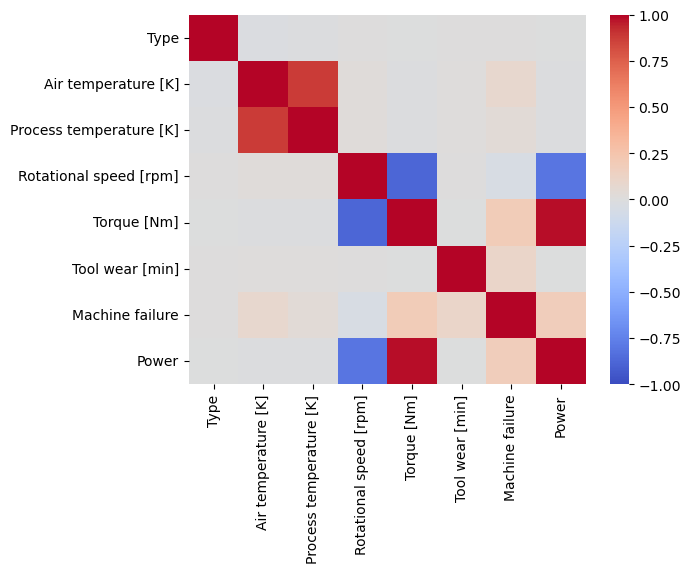

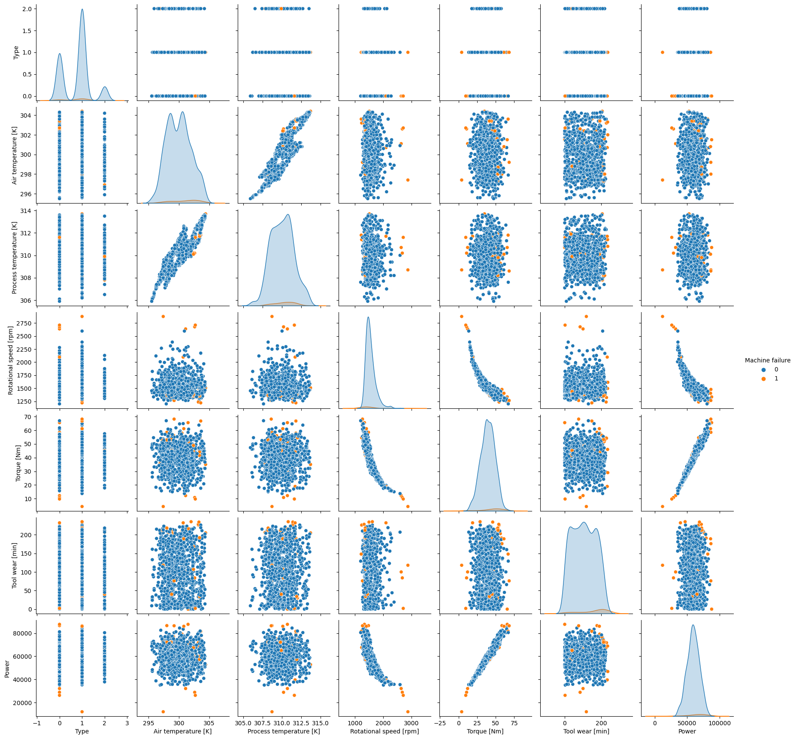

### Data Preprocessing (Cont.)

Then we divide the features and labels, encapsulate the data into a `Dataset` object, and split the data into training and testing sets.

Note that to prevent the random division from being unbalanced, we write a new function to divide the positive and negative samples separately and then merge them:

```python
from simple_ml.data.dataset import *
from simple_ml.data.samples import *

dataset = Dataset(data = data_np, preprocess_func = label_split_for_single_output_dataset)
train_dataset_raw, test_dataset = split_train_and_test_dataset_with_equal_binary_label(dataset, 0.3, seed = 42)

print(np.sum(test_dataset.datas[1]) / (np.sum(train_dataset_raw.datas[1]) + np.sum(test_dataset.datas[1])))
```

The implementation of the `split_train_and_test_dataset_with_equal_binary_label` function is as follows:

```python
def split_train_and_test_dataset_with_equal_binary_label(dataset, test_ratio = 0.2, seed = None):
    data_raw = dataset.data_raw.copy()
    preprocess_func = dataset.preprocess_func
    del dataset

    label_0_data = data_raw[data_raw[:, -1] == 0]
    label_1_data = data_raw[data_raw[:, -1] == 1]

    if seed is not None:
        np.random.seed(seed)

    np.random.shuffle(label_0_data)
    np.random.shuffle(label_1_data)

    split_index_0 = int(label_0_data.shape[0] * (1 - test_ratio))
    split_index_1 = int(label_1_data.shape[0] * (1 - test_ratio))

    train_data_0, test_data_0 = label_0_data[:split_index_0], label_0_data[split_index_0:]
    train_data_1, test_data_1 = label_1_data[:split_index_1], label_1_data[split_index_1:]

    train_data = np.vstack([train_data_0, train_data_1])
    test_data = np.vstack([test_data_0, test_data_1])

    np.random.shuffle(train_data)
    np.random.shuffle(test_data)

    train_dataset = Dataset(data = train_data, preprocess_func = preprocess_func)
    test_dataset = Dataset(data = test_data, preprocess_func = preprocess_func)

    return train_dataset, test_dataset
```

Next, noting the imbalance of positive and negative samples in the dataset, the number of samples with faults is extremely small, and we handle this using a variety of methods, such as random oversampling, random undersampling, and clustered undersampling.

Specifically, the implementation is in `simple_ml.data.dataset`. Below are the call implementations, as well as the choice, after testing, to use SMOTE for upsampling.

```python
from imblearn.over_sampling import SVMSMOTE

sampler = SVMSMOTE(random_state = 42)
features_bal, labels_bal = sampler.fit_resample(train_dataset_raw.datas[0], train_dataset_raw.datas[1])
train_dataset_bal = Dataset(data = np.c_[features_bal, labels_bal], preprocess_func = label_split_for_single_output_dataset)
```

Finally Mean Normalization is performed on the features of the training set for subsequent training and the parameters are recorded and applied to the test set.

```python
from sklearn.preprocessing import StandardScaler

scaler = StandardScaler()
train_dataset_bal.datas[0] = scaler.fit_transform(train_dataset_bal.datas[0])
test_dataset.datas[0] = scaler.transform(test_dataset.datas[0])

# features_means = np.mean(train_dataset.datas[0], axis = 0)
# features_stds = np.std(train_dataset.datas[0], axis = 0)

# def normalize_with_stored_params(features):
#     return (features - features_means) / features_stds

# train_dataset.datas[0] = normalize_with_stored_params(train_dataset.datas[0])
# test_dataset.datas[0] = normalize_with_stored_params(test_dataset.datas[0])
```

### Model Implementation

The model implementation is basically inherited from the framework of the fifth assignment (MLP), in which I implemented a more general neural network training framework. In this assignment, we need to implement four models, linear regression, perceptron, logistic regression and multilayer perceptron (MLP), all of which can be implemented using this framework:

```python
from simple_ml.model import *
from simple_ml.model.layers import *
from simple_ml.training.loss import *
from simple_ml.training.optimizer import *
from simple_ml.evaluation.criterion import *
```

#### Linear Regression

The linear regression model is equivalent to a single-layer neural network without activation function. The implementation is as follows (the code for `simple_ml` can be checked in the source zip file and the documents can be found in the previous assignments):

```python
def linreg(optimizer, epoch_num, batch_size):
    model = Linear(fN, 1)
    loss_func = MSELoss()
    optimizer.params = model.params

    train_iter = DataIterator(train_dataset_bal, batch_size = batch_size, shuffle = True, cyclic = False)

    train_loss_buffer = []

    for epoch in range(epoch_num):
        train_loss = 0

        for batch, [features, labels] in enumerate(train_iter):
            prediction = model(Variable(features))
            loss = loss_func(prediction, labels)

            model.backward()
            optimizer.step()

            train_loss += loss
        
        train_loss /= len(train_dataset_bal)
        train_loss_buffer.append(train_loss)

        if (epoch + 1) % (epoch_num // 10) == 0:
            print(f'Epoch: {epoch + 1} / {epoch_num}')

    fig = plt.figure(1)
    plt.plot(np.arange(len(train_loss_buffer)), train_loss_buffer)
    plt.show()

    test_prediction = model(Variable(test_dataset.datas[0]))

    decision_threshold = 0.5
    [[TP, FN], [FP, TN]] = eval_binary_confusion_matrix(test_prediction, test_dataset.datas[1], decision_boundary = decision_threshold, label_pos = 1, label_neg = 0)
    print(f'TP: {TP}, FP: {FP}, TN: {TN}, FN: {FN}')
    test_accuracy = (TP + TN) / (TP + TN + FP + FN)
    test_recall = TP / (TP + FN)
    test_precision = TP / (TP + FP)
    test_f1_score = 2 * test_precision * test_recall / (test_precision + test_recall) if test_precision + test_recall > 0 else 0
    print(f'Test: ACC = {test_accuracy}, REC = {test_recall}, PRE = {test_precision}, F1 = {test_f1_score}')


optimizer = GD(None, lr = 0.0002)
linreg(optimizer, epoch_num = 3000, batch_size = len(train_dataset_bal) // 20)
```

The result is as follows:

```
TP: 69, FP: 350, TN: 2549, FN: 33
Test: ACC = 0.8723758747084305, REC = 0.6764705882352942, PRE = 0.16467780429594273, F1 = 0.2648752399232246
```

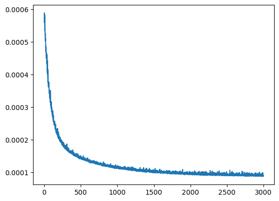

#### Perceptron

The perceptron model is a little different from the linear regression model. A `Linear` layer is still used, but the loss function is changed to `BinaryPerceptronLoss`, which is not implemented in the framework. We add the implementation:

```python
class BinaryPerceptronLoss(Loss):
    def _range_transform(self, T):
        """
            T is transformed to -1 and 1 for binary classification, where 0 -> -1 and 1 -> 1.
            TODO: customizing the target labels
        """
        return 2 * T - 1

    def forward(self, X, T):
        """
            L = max(0, -t * y)
        """
        T_transformed = self._range_transform(T)
        loss = np.maximum(0, -T_transformed * X.value)
        return np.mean(loss)
    
    def backward(self, X, T):
        """
            dL/dX = -T_transformed if -T_transformed * X < 0, otherwise 0
        """
        T_transformed = self._range_transform(T)
        gradient = np.where(-T_transformed * X.value > 0, -T_transformed, 0)
        X.gradient = gradient / X.value.shape[0]
```

Then we train the model and evaluate it:

```python
def perceptron(optimizer, epoch_num, batch_size):
    model = Linear(fN, 1)
    loss_func = BinaryPerceptronLoss()
    optimizer.params = model.params

    train_iter = DataIterator(train_dataset_bal, batch_size = batch_size, shuffle = True, cyclic = False)

    train_loss_buffer = []

    for epoch in range(epoch_num):
        train_loss = 0

        for batch, [features, labels] in enumerate(train_iter):
            prediction = model(Variable(features))
            loss = loss_func(prediction, labels)

            model.backward()
            optimizer.step()

            train_loss += loss
        
        train_loss /= len(train_dataset_bal)
        train_loss_buffer.append(train_loss)

        if (epoch + 1) % (epoch_num // 10) == 0:
            print(f'Epoch: {epoch + 1} / {epoch_num}')

    fig = plt.figure(1)
    plt.plot(np.arange(len(train_loss_buffer)), train_loss_buffer)
    plt.show()

    test_prediction = model(Variable(test_dataset.datas[0]))
    [[TP, FN], [FP, TN]] = eval_binary_confusion_matrix(test_prediction, test_dataset.datas[1], decision_boundary = 0, label_pos = 1, label_neg = 0)
    print(f'TP: {TP}, FP: {FP}, TN: {TN}, FN: {FN}') # TODO
    test_accuracy = (TP + TN) / (TP + TN + FP + FN)
    test_recall = TP / (TP + FN)
    test_precision = TP / (TP + FP)
    test_f1_score = 2 * test_precision * test_recall / (test_precision + test_recall) if test_precision + test_recall > 0 else 0
    print(f'Test: ACC = {test_accuracy}, REC = {test_recall}, PRE = {test_precision}, F1 = {test_f1_score}')


optimizer = GD(None, lr = 0.02)
perceptron(optimizer, epoch_num = 1000, batch_size = len(train_dataset_bal) // 100)
```

```
TP: 76, FP: 282, TN: 2617, FN: 26
Test: ACC = 0.8973675441519493, REC = 0.7450980392156863, PRE = 0.2122905027932961, F1 = 0.3304347826086957
```

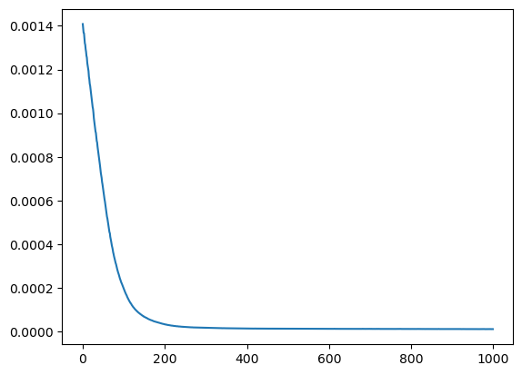

#### Logistic Regression

Add an `Sigmoid` activation function to the Linear Regression model and change the loss function into `CrossEntropyLoss` we obtain the Logistic Regression:

```python
def logreg(optimizer, epoch_num, batch_size):
    model = Sequential([
        Linear(fN, 1),
        Sigmoid()
    ])
    loss_func = CrossEntropyLoss()
    optimizer.params = model.params

    train_iter = DataIterator(train_dataset_bal, batch_size = batch_size, shuffle = True, cyclic = False)

    train_loss_buffer = []

    for epoch in range(epoch_num):
        train_loss = 0

        for batch, [features, labels] in enumerate(train_iter):
            prediction = model(Variable(features))
            loss = loss_func(prediction, labels)

            model.backward()
            optimizer.step()

            train_loss += loss
        
        train_loss /= len(train_dataset_bal)
        train_loss_buffer.append(train_loss)

        if (epoch + 1) % (epoch_num // 10) == 0:
            print(f'Epoch: {epoch + 1} / {epoch_num}')

    fig = plt.figure(1)
    plt.plot(np.arange(len(train_loss_buffer)), train_loss_buffer)
    plt.show()

    test_prediction = model(Variable(test_dataset.datas[0]))
    [[TP, FN], [FP, TN]] = eval_binary_confusion_matrix(test_prediction, test_dataset.datas[1], decision_boundary = 0.5, label_pos = 1, label_neg = 0)
    print(f'TP: {TP}, FP: {FP}, TN: {TN}, FN: {FN}')
    test_accuracy = (TP + TN) / (TP + TN + FP + FN)
    test_recall = TP / (TP + FN)
    test_precision = TP / (TP + FP)
    test_f1_score = 2 * test_precision * test_recall / (test_precision + test_recall) if test_precision + test_recall > 0 else 0
    print(f'Test: ACC = {test_accuracy}, REC = {test_recall}, PRE = {test_precision}, F1 = {test_f1_score}')


optimizer = GD(None, lr = 0.03)
logreg(optimizer, epoch_num = 3000, batch_size = len(train_dataset_bal) // 50)
```

And here's the results:

```
TP: 76, FP: 277, TN: 2622, FN: 26
Test: ACC = 0.8990336554481839, REC = 0.7450980392156863, PRE = 0.21529745042492918, F1 = 0.33406593406593404
```

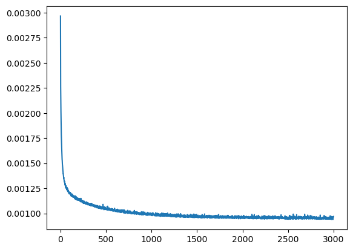

#### Multilayer Perceptron (MLP)

Finally here comes the MLP. The structure of MLP is flexible and we first use a network with one hidden layer with 100 hidden neurons as an example:

```python
def mlp(model, loss_func, optimizer, epoch_num, batch_size):
    train_iter = DataIterator(train_dataset_bal, batch_size = batch_size, shuffle = True, cyclic = False)

    train_loss_buffer = []

    for epoch in range(epoch_num):
        train_loss = 0

        for batch, [features, labels] in enumerate(train_iter):
            prediction = model(Variable(features))
            loss = loss_func(prediction, labels)

            model.backward()
            optimizer.step()

            train_loss += loss
        
        train_loss /= len(train_dataset_bal)
        train_loss_buffer.append(train_loss)

        if (epoch + 1) % (epoch_num // 10) == 0:
            print(f'Epoch: {epoch + 1} / {epoch_num}')

    fig = plt.figure(1)
    plt.plot(np.arange(len(train_loss_buffer)), train_loss_buffer)
    plt.show()

    test_prediction = model(Variable(test_dataset.datas[0]))
    [[TP, FN], [FP, TN]] = eval_binary_confusion_matrix(test_prediction, test_dataset.datas[1], decision_boundary = 0.5, label_pos = 1, label_neg = 0)
    print(f'TP: {TP}, FP: {FP}, TN: {TN}, FN: {FN}')
    test_accuracy = (TP + TN) / (TP + TN + FP + FN)
    test_recall = TP / (TP + FN)
    test_precision = TP / (TP + FP)
    test_f1_score = 2 * test_precision * test_recall / (test_precision + test_recall) if test_precision + test_recall > 0 else 0
    print(f'Test: ACC = {test_accuracy}, REC = {test_recall}, PRE = {test_precision}, F1 = {test_f1_score}')


model = Sequential([
    Linear(fN, 100),
    ReLU(),
    Linear(100, 1),
    Sigmoid()
])
loss_func = CrossEntropyLoss()
optimizer = GD(model.params, lr = 0.01)
mlp(model, loss_func, optimizer, epoch_num = 3000, batch_size = len(train_dataset_bal) // 10)
```

And the result is:

```
TP: 84, FP: 242, TN: 2657, FN: 18
Test: ACC = 0.9133622125958014, REC = 0.8235294117647058, PRE = 0.25766871165644173, F1 = 0.3925233644859813
```

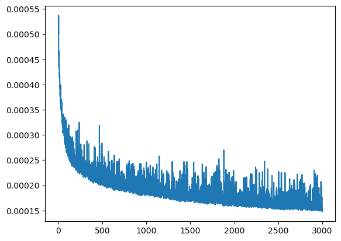

## Findings and Conclusion

### Model Comparison

Linear Regression, Perceptron, Logistic Regression and MLP were implemented earlier and tested briefly (fine tuning is done next).

As reflected in the simple tests, the Test F1 Scores obtained by Linear Regression, Perceptron and Logistic Regression are not very different, all of them are at the level of 0.3 or slightly less. The linear regression results are stable but the overall results are slightly lower than the other models; the loss function of the perceptron model is non-convex, so the training results are sometimes poor, and the better results after several attempts are similar to the other models.

The MLP is only a simple test with a single hidden layer (100 neurons), and the results are obviously better than the other models, and it can be observed that there is still room for improvement, and the hyperparameters are adjusted subsequently.

Overall, Accuracy is not indicative due to the uneven labelling of the data.F1 is calculated from Recall and Precision, where Recall is high and Precision is low, i.e., 0s are often misclassified as 1s.

### Hyperparameter Tuning

Linear regression, perceptual machine and logistic regression are all relatively standard, and the main hyperparameters that can be adjusted are the training parameters such as epoch_num, batch_size, learning_rate, etc., which have been adjusted many times to achieve a more stable result before getting the above results. The main hyper-parameters to be adjusted are the MLP method, we selected a series of MLPs with different structures, trained them several times, and adjusted them to a more appropriate epoch_num and batch_size in the process, and the results are as follows:
])

#### Test 1

```python
model = Sequential([
    Linear(fN, 5),
    ReLU(),
    Linear(5, 1),
    Sigmoid()
])
loss_func = CrossEntropyLoss()
optimizer = GD(model.params, lr = 0.01)
mlp(model, loss_func, optimizer, epoch_num = 10000, batch_size = len(train_dataset_bal) // 20)
```

```
TP: 79, FP: 225, TN: 2674, FN: 23
Test: ACC = 0.9173608797067644, REC = 0.7745098039215687, PRE = 0.2598684210526316, F1 = 0.3891625615763547
```

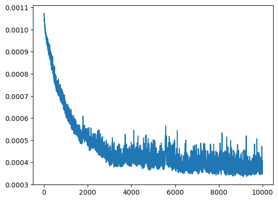

#### Test 2

```python
model = Sequential([
    Linear(fN, 25),
    ReLU(),
    Linear(25, 1),
    Sigmoid()
])
loss_func = CrossEntropyLoss()
optimizer = GD(model.params, lr = 0.01)
mlp(model, loss_func, optimizer, epoch_num = 5000, batch_size = len(train_dataset_bal) // 20)
```

```
TP: 84, FP: 245, TN: 2654, FN: 18
Test: ACC = 0.9123625458180606, REC = 0.8235294117647058, PRE = 0.2553191489361702, F1 = 0.38979118329466356
```

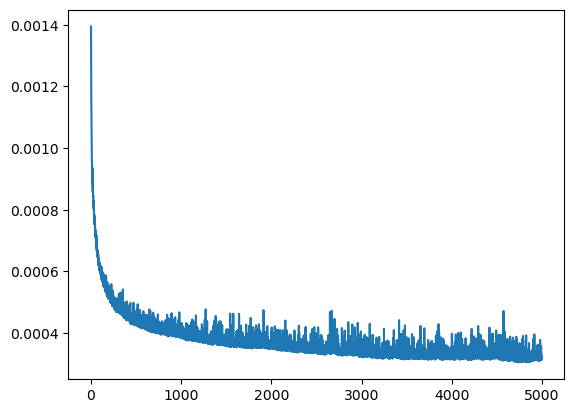

#### Test 3

```python
model = Sequential([
    Linear(fN, 50),
    ReLU(),
    Linear(50, 1),
    Sigmoid()
])
loss_func = CrossEntropyLoss()
optimizer = GD(model.params, lr = 0.01)
mlp(model, loss_func, optimizer, epoch_num = 20000, batch_size = len(train_dataset_bal) // 20)
```

```
TP: 83, FP: 194, TN: 2705, FN: 19
Test: ACC = 0.9290236587804065, REC = 0.8137254901960784, PRE = 0.2996389891696751, F1 = 0.4379947229551451
```

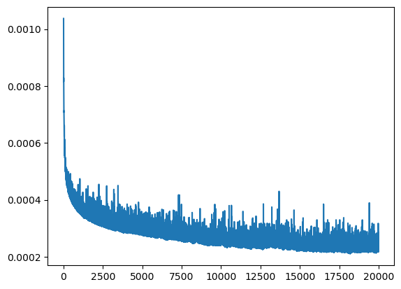

#### Test 4

```python
model = Sequential([
    Linear(fN, 10),
    Tanh(),
    Linear(10, 10),
    Tanh(),
    Linear(10, 1),
    Sigmoid()
])
loss_func = CrossEntropyLoss()
optimizer = GD(model.params, lr = 0.01)
mlp(model, loss_func, optimizer, epoch_num = 5000, batch_size = len(train_dataset_bal) // 20)
```

```
TP: 80, FP: 253, TN: 2646, FN: 22
Test: ACC = 0.9083638787070977, REC = 0.7843137254901961, PRE = 0.24024024024024024, F1 = 0.367816091954023
```

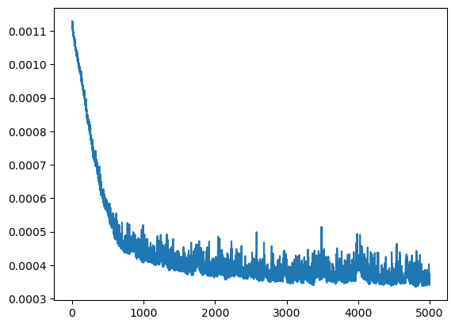

#### Test 5

```python
model = Sequential([
    Linear(fN, 20),
    Tanh(),
    Linear(20, 20),
    Tanh(),
    Linear(20, 1),
    Sigmoid()
])
loss_func = CrossEntropyLoss()
optimizer = GD(model.params, lr = 0.01)
mlp(model, loss_func, optimizer, epoch_num = 40000, batch_size = len(train_dataset_bal) // 30)
```

```
TP: 80, FP: 162, TN: 2737, FN: 22
Test: ACC = 0.9386871042985672, REC = 0.7843137254901961, PRE = 0.3305785123966942, F1 = 0.46511627906976744
```

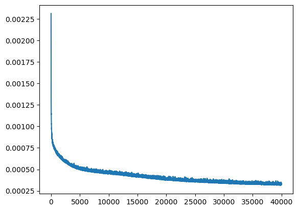

#### Test 6

```python
model = Sequential([
    Linear(fN, 10),
    Tanh(),
    Linear(10, 10),
    Tanh(),
    Linear(10, 10),
    Tanh(),
    Linear(10, 1),
    Sigmoid()
])
loss_func = CrossEntropyLoss()
optimizer = GD(model.params, lr = 0.01)
mlp(model, loss_func, optimizer, epoch_num = 20000, batch_size = len(train_dataset_bal) // 20)
```

```
TP: 81, FP: 248, TN: 2651, FN: 21
Test: ACC = 0.9103632122625791, REC = 0.7941176470588235, PRE = 0.24620060790273557, F1 = 0.37587006960556846
```

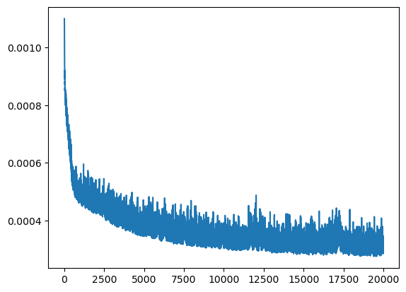

#### Further Trials

It was found that the model with 20 neurons in each of the two hidden layers had a stable training process with better results, and an attempt was made to provide a longer training time:

```python
model = Sequential([
    Linear(fN, 20),
    Tanh(),
    Linear(20, 20),
    Tanh(),
    Linear(20, 1),
    Sigmoid()
])
loss_func = CrossEntropyLoss()
optimizer = GD(model.params, lr = 0.01)
mlp(model, loss_func, optimizer, epoch_num = 80000, batch_size = len(train_dataset_bal) // 30)
```

```
TP: 80, FP: 184, TN: 2715, FN: 22
Test: ACC = 0.931356214595135, REC = 0.7843137254901961, PRE = 0.30303030303030304, F1 = 0.4371584699453552
```

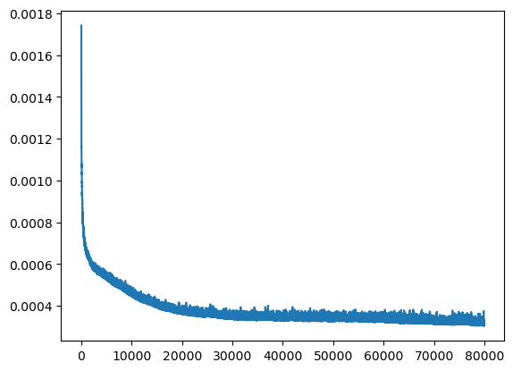

The best final result (F1 Score) is around 0.44.
